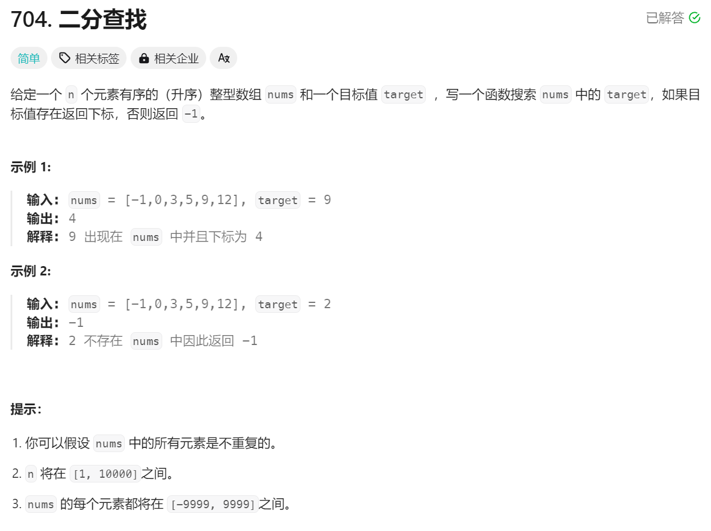
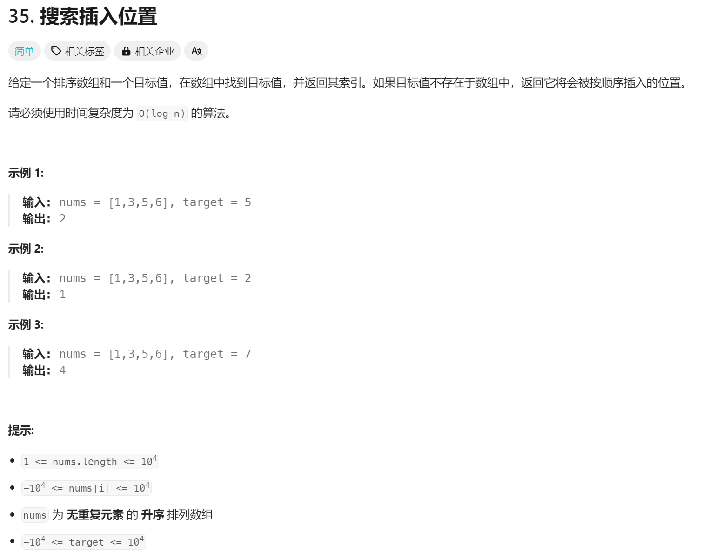
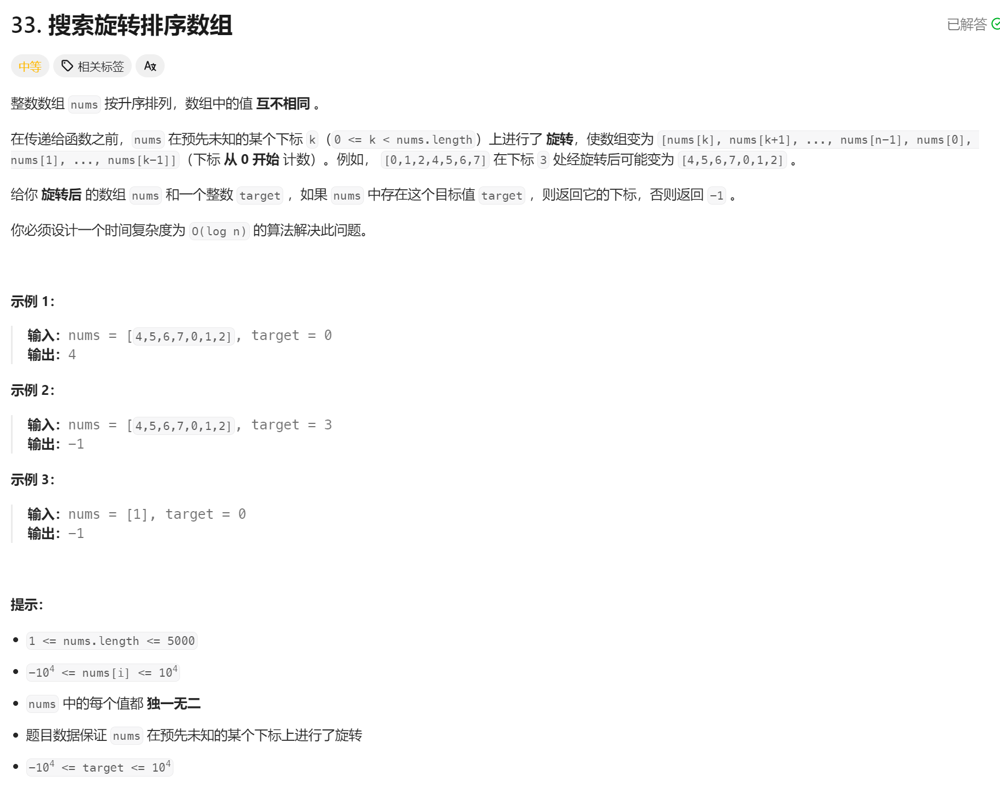
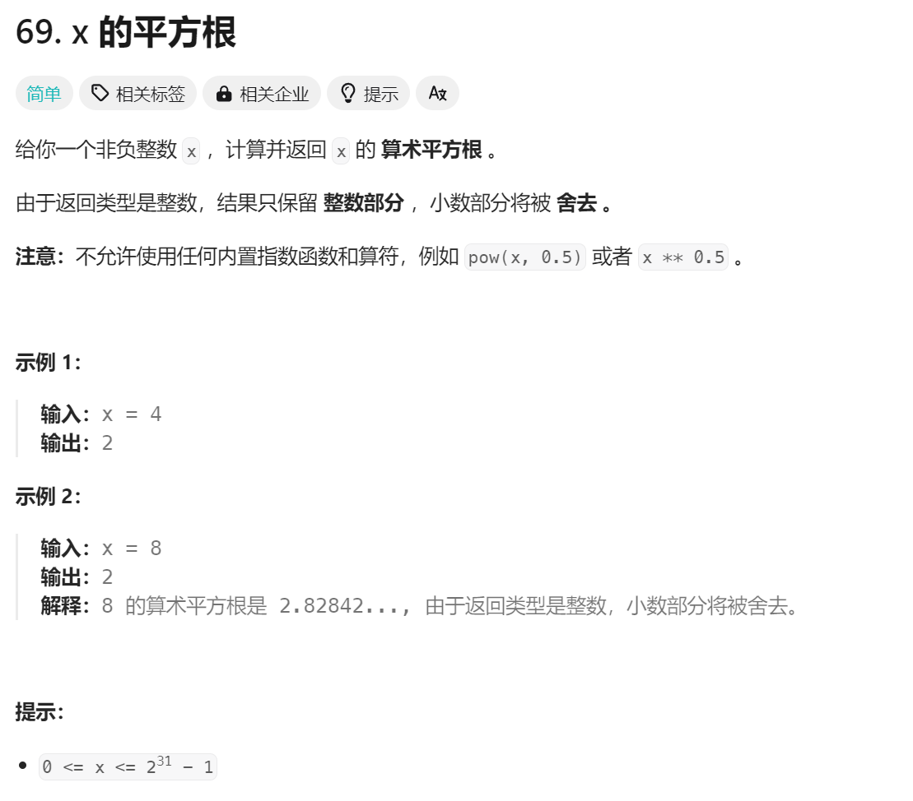
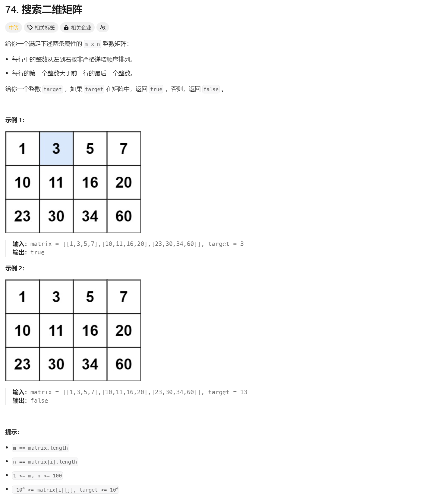
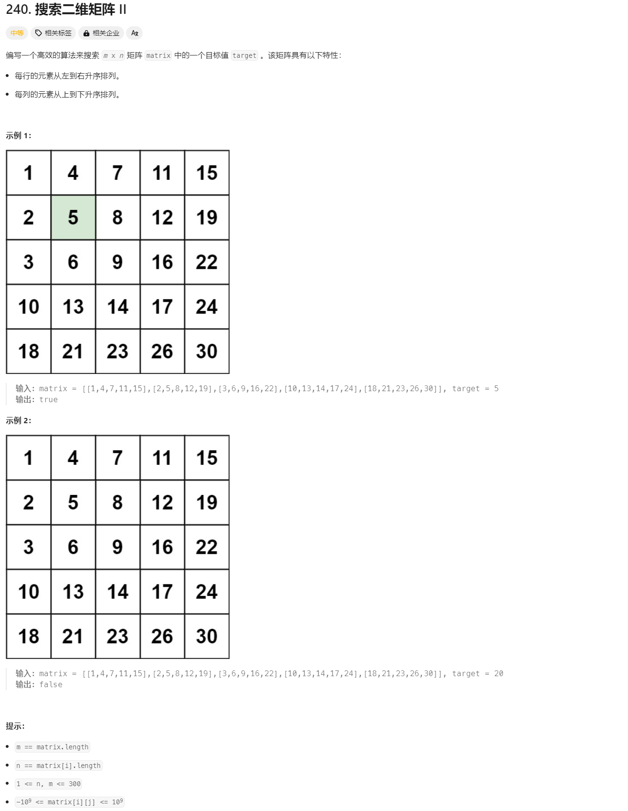

# 二分查找题解

- 核心词：有序。

## 一、704 二分查找 简单

- 标志词
  - 有序数组
- 解法
  1. 将 left = 0, right = nums.length - 1，使用 `[]` 区间
  2. 找到中间值，与 target 比较
     1. target = `nums[mid]` => return;
     2. target < `nums[mid]` => 往左半部分找 => right = mid - 1
     3. `nums[mid]` < target => 往右半部分找 => left = mid + 1
  3. 重复步骤 2
  4. 直至找到 left > right 为止 => 循环结束条件
     - 若 left = right，还存在一个值可以与 target 比较
- [代码](./code/01-704.js)

## 二、35 搜索插入位置 简单

- 标志词：
  - 排序数组
- 解法
  1. 仍然使用 `[]` 区间: left = 0, right = nums.length - 1
  2. 找到中间值，与 target 比较
     1. target = `nums[mid]` => return;
     2. target < `nums[mid]` => 往左半部分找 => right = mid - 1
     3. `nums[mid]` < target => 往右半部分找 => left = mid + 1
  3. 重复步骤 2
  4. 直至找到 left > right 为止 => 循环结束条件
     - 此时 `nums[right]` < target < `nums[left]` => 插入操作，所以应取代 nums[left] => return left
- [代码](./code/02-35.js)

## 三、33 搜索旋转排序数组 中等

- 解法
  1. 使用 `[]` 区间: left = 0, right = nums.length - 1
  2. 找到中间值，判断哪边是有序区间
     1. target = `nums[left/mid/right]` => return left/mid/right;
     2. if `nums[left]` < `nums[mid]`，左边为有序区间 (无需考虑 left = mid 情况，若这种情况，在 上一步中已经比较过，必定找不到)
        1. `nums[left]` < target < `nums[mid]` => target 在有序区间内 => right = mid - 1
        2. => target 在无序区间 => left = mid + 1
     3. 右边为有序区间
        1. `nums[left]` < target < `nums[mid]` => target 在有序区间内 => left = mid + 1
        2. => target 在无序区间 => right = mid - 1
- [代码](./code/03-33.js)

## 四、69 x 的平方根 简单

- 解法
  - `i * i` => i 的平方，与 x 比较即可
- [代码](./code/04-69.js)

## 五、74 搜索二维矩阵 中等

- 解法
  1. 使用 `[]` 区间: left = 0, right = matrix.length - 1;
  2. 找到中间的数组，先比较首尾元素
     1. 若与第一个或最后一个相等，直接返回 true
     2. `arr[start] < target < arr[end]` => 对该数组进行二分查找
     3. `target < arr[start]` => right = mid - 1
     4. `target > arr[end]` => left = mid + 1
  3. 重复步骤 2
- [代码](./code/05-74.js)

## 六、240 搜索二维矩阵 Ⅱ 中等

- 解法
  1. 以左下角 `matrix[m-1][0]` 为起始点，与 target 进行大小比较(x = m - 1, y = 0)
     1. `matrix[x][y]` = target => return true
     2. `matrix[x][y]` > target => target 一定在 `matrix[m-1][0]` 的上面 => x--
        - 左下已经在上一次的比较中被排除
     3. `matrix[x][y]` < target => target 一定在 `matrix[m-1][0]` 的右边 => y++
        - 左下已经在上一次的比较中被排除
  2. 重复步骤 1
- 核心：选好起始点
- [代码](./code/05-74.js)
